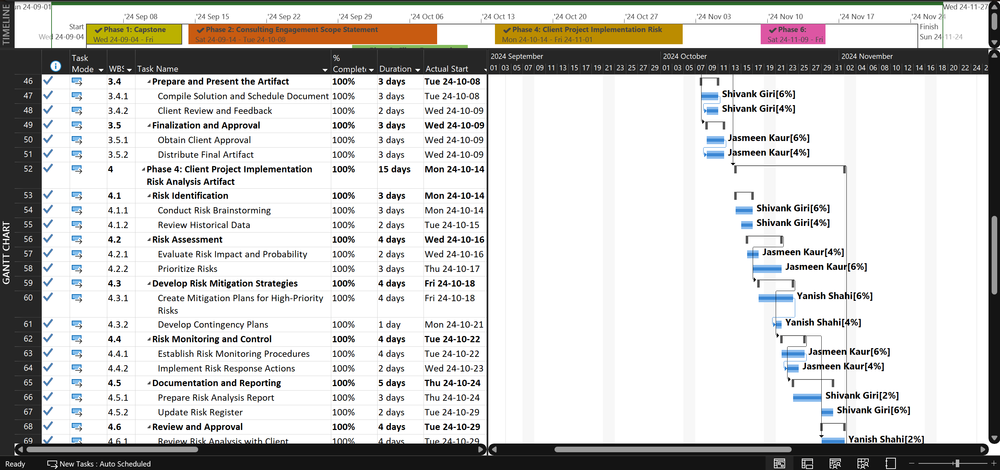
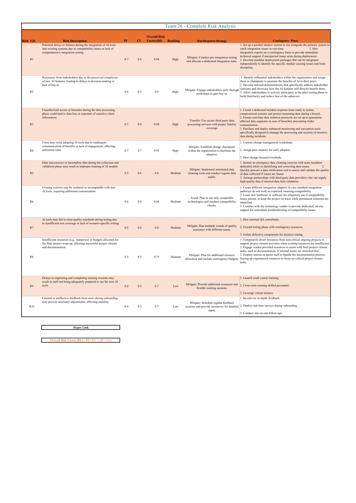
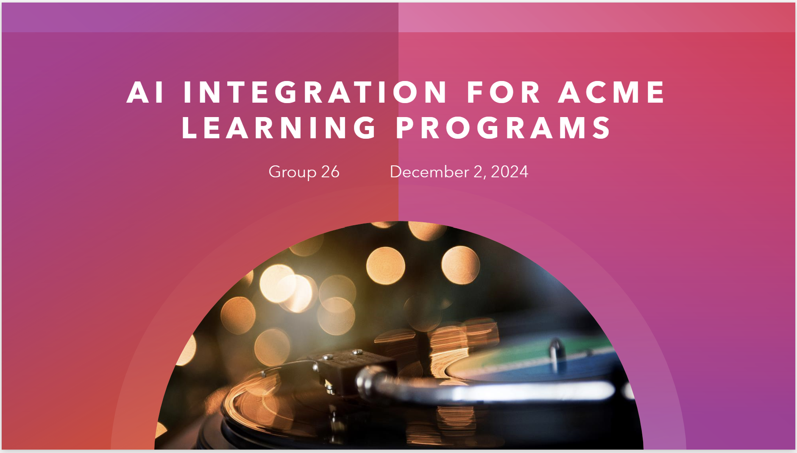
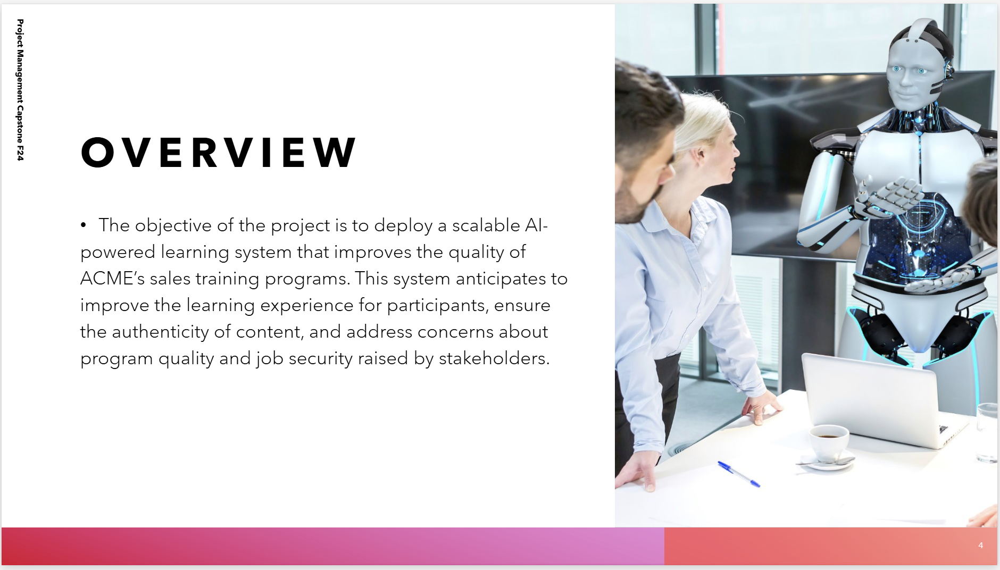
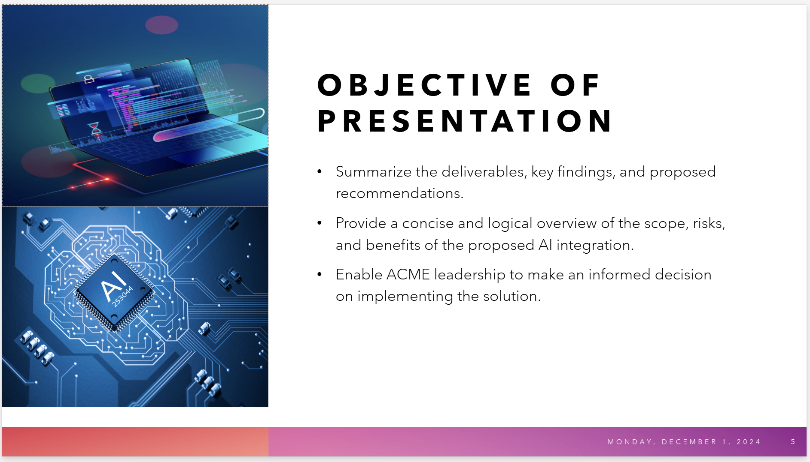
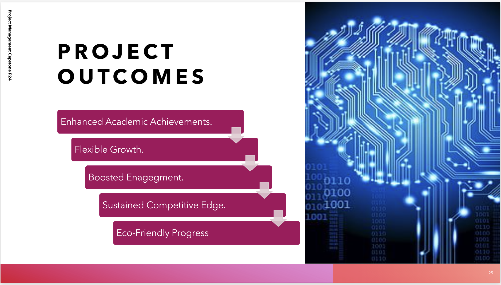

# 🤖 ACME AI Integration – Capstone Consulting Project

**Team 26 | Fall 2024 | Georgian College**

A strategic consulting project focused on integrating Artificial Intelligence (AI) into the sales training programs of **ACME Corporation**, impacting over 3,000 students across five campuses. This initiative aimed to improve learning effectiveness while addressing stakeholder concerns about authenticity, cost, and instructor roles.

Our team planned and delivered a comprehensive project lifecycle—from scope definition and risk analysis to budgeting, stakeholder communication, and a final executive presentation.

---

## 🚀 Executive Summary

This capstone project was executed as a simulated professional consulting engagement. Our team acted as external consultants for ACME Corporation, designing an AI-enhanced learning solution. We developed planning and implementation artifacts including a Gantt chart, budget report, risk register, scope statement, and final portfolio report.

The project emphasized **project management principles**, **AI strategy**, and **stakeholder alignment**, offering hands-on experience in real-world consulting practices.

---

## 🎯 Project Objectives

- Identify and evaluate AI opportunities within existing training programs
- Develop a strategic, scalable AI integration plan
- Ensure budget compliance and risk mitigation
- Align the solution with business and educational goals
- Deliver professional documentation and presentations for stakeholder buy-in

---

## 📁 Key Deliverables

| Phase   | Deliverable |
|---------|-------------|
| Phase 1 | [Capstone Consulting Engagement Schedule (Gantt Chart)](./phase_1.mpp) |
| Phase 2 | [Scope Statement (Word)](./phase_2_word.docx), [RACI Matrix (Gantt Chart)](./phase_2.mpp) |
| Phase 3 | [Client AI Solution & Implementation Plan](./phase_3_word.docx) |
| Phase 4 | [Risk Analysis Artifact (Excel)](./phase_4.xlsx) |
| Phase 5 | [Budget and Cost Overview (Gantt Chart)](./phase_5.mpp) |
| Phase 6 | [Final Implementation Portfolio Report (PDF)](./phase_6.pdf) |
| Phase 7 | [Final Stakeholder Buy-In Presentation (PowerPoint)](./phase_7.pptx) |

---

## 🛠️ Tools & Technologies Used

- **Microsoft Project** – Schedule, Gantt charts
- **Microsoft Excel** – Budgeting, cost tracking, risk matrix
- **Microsoft Word** – Scope statements, documentation
- **Microsoft Teams** – Collaboration & communications
- **PowerPoint** – Final stakeholder presentation

---

## 👥 Team Members & Roles

- **Shivank Giri** – Budgeting, API strategy, stakeholder engagement
- **Jasmeen Kaur** – Gantt charting, risk analysis, QA testing
- **Yanish Shahi** – Scope documentation, module development, reporting

> 💼 All team members worked ~2 hours/week. Tasks were managed using a RACI chart.

---

## 📅 Timeline

**Start:** September 2024  
**End:** November 2024  
**Duration:** 10 weeks

---

## 📊 Screenshots 

Here are key visuals from our final capstone project deliverables and presentation:

### 📌 Gantt Chart (Project Schedule)

### 📌 Risk Matrix

### 📌 Title Slide

### 📌 Project Overview Slide

### 📌 Objectives Slide

### 📌 Summary Slide

---

## 💡 What I Learned

- Strategic project planning under real-world constraints
- AI integration analysis for corporate training systems
- Risk assessment and stakeholder alignment techniques
- Agile communication within consulting engagements
- Professional-level documentation and reporting

---

## 📌 Tags / Skills

`Project Management` • `AI Integration` • `Consulting` • `MS Project` • `Budget Planning` • `Risk Analysis` • `Stakeholder Engagement`

---

## 📬 Contact

Want to collaborate or learn more?  
📧 Email: [shivank1998@hotmail.com](mailto:shivank1998@hotmail.com)  
🔗 LinkedIn: [www.linkedin.com/in/shivank-giri-4288b4316]

---

